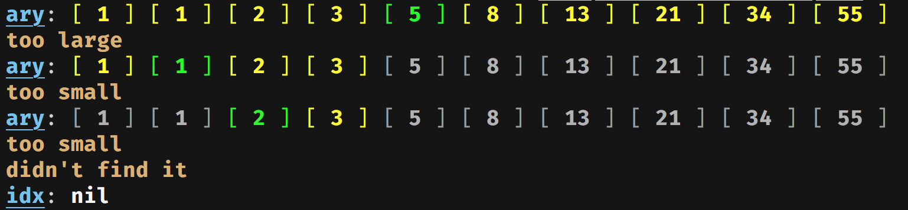

# tanj

There are two main approaches to debugging / poking around a program to see how it works: (1) using a debugger, and (2) inserting print statements. Debuggers are complex pieces of software loaded with features (such as time travel??). Print statements are the complete opposite: primitive statements that come with the language. "Hello world"s. Yet [many](https://lwn.net/2000/0914/a/lt-debugger.php3) [well-known](https://www.artima.com/weblogs/viewpost.jsp?thread=23476) [programmers](http://blog.jgc.org/2007/01/tao-of-debugging.html) strongly prefer print statements to using a debugger.

The way I see it, using a debugger is basically the same thing as using print statements. It's just that the debugger inserts the print statements for you, *on every single line of code*. Usually, you probably don't need that kind of power. Usually, you should probably be able to step back and realize you only need a couple things here and there to be printed out to answer whatever question you have about how this code works.

But I think there is room for debugger-style tooling around print statement debugging. The key is that the programmer still writes their own print statements, judiciously choosing where to place them and what info to log, and the output of these logs is still a stream of plaintext lines. Where there is room for tooling is in the *processing* of these plaintext logs.

`tanj` is going to be a standard format for print statement debugging logs. There will be helper libraries for each language to help print out logs in this standard format. Then, there will be multiple frontends (or one big full-featured frontend?) that will collect these logs and visualize the execution of your program over time. (Yes, we can have time travel too!)

It's all very experimental right now though. There is much to figure out still...

## Example

Here's a Ruby program that does a simple binary search. It has a bug.

```ruby
def binsearch(ary, x)
  left = 0
  right = ary.length - 1
  while left < right
    middle = (left + right) / 2
    if ary[middle] == x
      return middle
    elsif ary[middle] < x
      left = middle + 1
    elsif ary[middle] > x
      right = middle - 1
    else
      # unreachable
    end
  end
  nil
end

ary = [1, 1, 2, 3, 5, 8, 13, 21, 34, 55]
idx = binsearch(ary, ARGV.first.to_i)

p idx
```

You test it out like this:

```shell
$ ruby binsearch.rb 5
4
$ ruby binsearch.rb 8
5
$ ruby binsearch.rb 3
nil
```

It found `5` at `ary[4]`, and `8` at `ary[5]`, but it could not find the `3` that is at `ary[3]`. Bug!

You add some `print` statements to try and see what's going on:

```ruby
def binsearch(ary, x)
  left = 0
  right = ary.length - 1
  while left < right
    middle = (left + right) / 2
    puts "left = #{left}, right = #{right}, middle = #{middle}"
    puts "ary[middle] = #{ary[middle]}"
    if ary[middle] == x
      puts "found it!"
      return middle
    elsif ary[middle] < x
      puts "too small"
      left = middle + 1
    elsif ary[middle] > x
      puts "too large"
      right = middle - 1
    else
      puts "this should be unreachable!"
    end
    puts
  end
  puts "didn't find it"
  nil
end

ary = [1, 1, 2, 3, 5, 8, 13, 21, 34, 55]
idx = binsearch(ary, ARGV.first.to_i)

puts "idx = #{idx.inspect}"
```

And test it out with the failing case of searching for `3`:

```
$ ruby binsearch_print.rb 3
left = 0, right = 9, middle = 4
ary[middle] = 5
too large

left = 0, right = 3, middle = 1
ary[middle] = 1
too small

left = 2, right = 3, middle = 2
ary[middle] = 2
too small

didn't find it
idx = nil
```

After examining this a while, you realize the program is giving up after it's narrowed down the array to `ary[2..3]`, and it's checked `ary[2]` but hasn't checked `ary[3]`. The `while` loop needs to do one more iteration with `left = 3, right = 3`. To do that, `while left < right` needs to be changed to `while left <= right`, and that fixes the bug.

`tanj` improves the print-line debugging process by making it less tedious to print out variables and messages, and by making the output of these logs much more readable and manageable. Here is the same program using `tanj`:

```ruby
require 'tanj'

def binsearch(ary, x)
  left = 0
  right = ary.length - 1
  while left < right
    middle = (left + right) / 2
    Tanj.array :ary, index: [:left..:right, :middle]
    if ary[middle] == x
      Tanj.message "found it!"
      return middle
    elsif ary[middle] < x
      Tanj.message "too small"
      left = middle + 1
    elsif ary[middle] > x
      Tanj.message "too large"
      right = middle - 1
    else
      Tanj.message "this should be unreachable!"
    end
  end
  Tanj.message "didn't find it"
  return nil
end

ary = [1, 1, 2, 3, 5, 8, 13, 21, 34, 55]
idx = binsearch(ary, ARGV.first.to_i)

Tanj.var :idx
```

The program now logs these lines to `stderr`:

```json
tanj| {"type":"array","value":[1,1,2,3,5,8,13,21,34,55],"name":"ary","options":{"highlight":{"yellow":"0..9","green":4}},"where":{"line_num":14,"path":"/Users/pailey/projects/tanj/example/binsearch_tanj.rb","label":"binsearch"}}
tanj| {"type":"message","message":"too large","where":{"line_num":22,"path":"/Users/pailey/projects/tanj/example/binsearch_tanj.rb","label":"binsearch"}}
tanj| {"type":"array","value":[1,1,2,3,5,8,13,21,34,55],"name":"ary","options":{"highlight":{"yellow":"0..3","green":1}},"where":{"line_num":14,"path":"/Users/pailey/projects/tanj/example/binsearch_tanj.rb","label":"binsearch"}}
tanj| {"type":"message","message":"too small","where":{"line_num":19,"path":"/Users/pailey/projects/tanj/example/binsearch_tanj.rb","label":"binsearch"}}
tanj| {"type":"array","value":[1,1,2,3,5,8,13,21,34,55],"name":"ary","options":{"highlight":{"yellow":"2..3","green":2}},"where":{"line_num":14,"path":"/Users/pailey/projects/tanj/example/binsearch_tanj.rb","label":"binsearch"}}
tanj| {"type":"message","message":"too small","where":{"line_num":19,"path":"/Users/pailey/projects/tanj/example/binsearch_tanj.rb","label":"binsearch"}}
tanj| {"type":"message","message":"didn't find it","where":{"line_num":29,"path":"/Users/pailey/projects/tanj/example/binsearch_tanj.rb","label":"binsearch"}}
tanj| {"type":"variable","value":null,"name":"idx","where":{"line_num":36,"path":"/Users/pailey/projects/tanj/example/binsearch_tanj.rb","label":"<main>"}}
```

In theory, you could feed these logs into a fancy frontend that would produce very pretty visuals of what (you say) your program is doing, and let you filter for just the information you want, let you step forward and back in time, choose sensible granularities to show things in, intelligently group logs together and make connections between them, etc.

But for now, all I've got is a very basic terminal frontend that renders colourful arrays, just for this binary search example. To turn it on, add this config to the top of the program:

```ruby
Tanj.config(
  logger: Tanj::Logger::Self.new
)
```

Now all your logs will be directed to the `tanj` library itself for immediate printing, instead of being outputted to somewhere external.

And this is what you get:



So far it's just one contrived example, but this is only the beginning!
